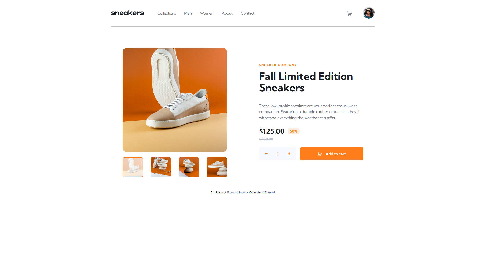

# Frontend Mentor - E-commerce product page solution

This is a solution to the [E-commerce product page challenge on Frontend Mentor](https://www.frontendmentor.io/challenges/ecommerce-product-page-UPsZ9MJp6). Frontend Mentor challenges help you improve your coding skills by building realistic projects.

## Table of contents

- [Overview](#overview)
  - [The challenge](#the-challenge)
  - [Screenshot](#screenshot)
  - [Links](#links)
- [My process](#my-process)
  - [Built with](#built-with)
  - [Continued development](#continued-development)
  - [Useful resources](#useful-resources)
- [Author](#author)

## Overview

### The challenge

Users should be able to:

- View the optimal layout for the site depending on their device's screen size
- See hover states for all interactive elements on the page
- Open a lightbox gallery by clicking on the large product image
- Switch the large product image by clicking on the small thumbnail images
- Add items to the cart
- View the cart and remove items from it

### Screenshot

### Links

- Live Site URL: https://mgsimard.github.io/frontendmentor/ecommerce-product-page/index.html

## My process

### Built with

- Semantic HTML5 markup
- CSS custom properties
- Flexbox
- CSS Grid
- Javascript
- Mobile-first workflow
- Chocolate & Vanilla

### Continued development

Plan better instead of adjusting on the fly, had to redo some things multiple times because I jumped straight into it, mostly picked this for the sake of the lightbox stuff since I wanted to make one for my portfolio website.

## Author

- Website - [MGSimard @ Github](https://mgsimard.github.io/)
- Frontend Mentor - [@MGSimard](https://www.frontendmentor.io/profile/MGSimard)