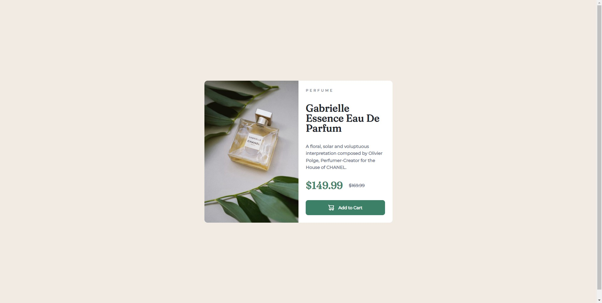

# Frontend Mentor - Product preview card component solution

This is a solution to the [Product preview card component challenge on Frontend Mentor](https://www.frontendmentor.io/challenges/product-preview-card-component-GO7UmttRfa). Frontend Mentor challenges help you improve your coding skills by building realistic projects. 

## Table of contents

- [Overview](#overview)
  - [The challenge](#the-challenge)
  - [Screenshot](#screenshot)
  - [Links](#links)
- [My process](#my-process)
  - [Built with](#built-with)
  - [What I learned](#what-i-learned)
- [Author](#author)

## Overview

### The challenge

Users should be able to:

- View the optimal layout depending on their device's screen size
- See hover and focus states for interactive elements

### Screenshot

### Links

- Live Site URL: https://mgsimard.github.io/frontendmentor/product-preview-card-component/index.html

## My process

### Built with

- Semantic HTML5 markup
- CSS custom properties
- Flexbox
- Mobile-first workflow

**Note: These are just examples. Delete this note and replace the list above with your own choices**

### What I learned

- Picture tag
- That when FrontEndMentor's style guide says "Font weight is 700" it really actually means something else entirely and your result will differ from the provided design image for the sake of making it more obnoxious than necessary to sell you access to Figma files which I will most definitely never do thank you enjoy the slightly less bold title

## Author

- Website - [MGSimard @ Github](https://mgsimard.github.io/)
- Frontend Mentor - [@MGSimard](https://www.frontendmentor.io/profile/MGSimard)